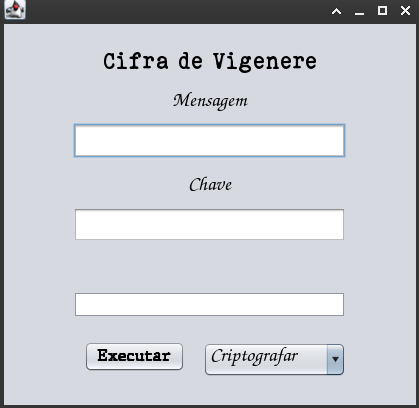

# Cifra de Vigenère em Java

[](https://java.com)
[](https://opensource.org/licenses/MIT)

Implementação gráfica da cifra de Vigenère com interface Swing, permitindo criptografia e descriptografia de textos.

 

## 🚀 Funcionalidades

- Criptografia/Descriptografia de textos
- Ajuste automático do tamanho da chave
- Interface gráfica intuitiva
- Tratamento de erros e validações
- Suporte para caracteres A-Z e espaço

## 📦 Pré-requisitos

- Java 17 ou superior
- Maven (opcional)
- IDE Java (Eclipse, NetBeans, VS Code)

## 🛠️ Como Executar

### 1. Clonar o repositório
```bash
git clone https://github.com/JP-Linux/cifra-vigenere-java.git
cd cifra-vigenere-java

```

### 2. Execute na IDE

1. ##### Importe o projeto como projeto Java existente

2. ##### Execute a classe principal:

   ```java
   cifradevigenere.CifraDeVigenere
   ```

### 3. Execução via linha de comando

    ```sh
       mvn clean compile exec:java -Dexec.mainClass="cifradevigenere.CifraDeVigenere"
    ```

## 🖥️ Como Usar

1. ##### Insira a mensagem (texto claro ou cifrado)

2. ##### Digite a chave (apenas letras maiúsculas e espaço)

3. ##### Selecione a operação:

   - "Criptografar" para cifrar o texto
   - "Descriptografar" para decifrar

4. ##### Clique em "Executar"

## 🔍 Características Técnicas

- **Arquitetura**: MVC (Model-View-Controller)
- **Componentes:**
  - `ControladorVigenere`: Lógica principal de processamento
  - `TabelaVigenere`: Tabela de substituição personalizada
  - `IgualarTamTexto`: Ajuste cíclico da chave

- **Validações**:
  - Campos obrigatórios
  - Caracteres válidos
  - Tratamento de exceções

## 📌 Notas

- ##### Caracteres válidos: A-Z (maiúsculas) e espaço

- ##### A chave será repetida ciclicamente para igualar ao tamanho do texto

- ##### Não suporta caracteres especiais ou acentuados

## 📄 Licença

Este projeto está licenciado sob a Licença MIT - veja o arquivo [LICENSE](LICENSE) para detalhes.

---

Desenvolvido por Jorge Paulo Santos 👨💻
Contribuições são bem-vindas! 🤝
